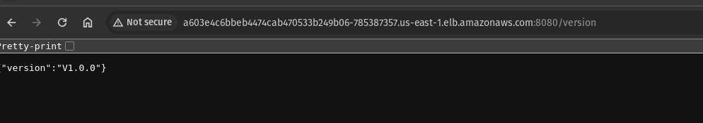

# Lifters devops-challenge 

## 1. Vamos instalar os comandos que iremos utilizar para a execução deste desafio:
- [Aws CLI](https://docs.aws.amazon.com/cli/latest/userguide/getting-started-install.html)
- [Docker](https://docs.docker.com/engine/install/ubuntu/)
- [Terraform](https://developer.hashicorp.com/terraform/tutorials/aws-get-started/install-cli)
- [Kubectl](https://kubernetes.io/docs/tasks/tools/)

## 2. Configurar o perfil aws 

```
 aws configure
```
#### OBS: Os acessos necessários estão no arquivo user1_accessKeys.csv


## 3. Dockerizar aplicação e fazer o push para o ECR(deixei criado previamente)
**OBS: Para que o Docker envie a imagem para o ECR, primeiro precisamos autenticar nossas credenciais do Docker com a AWS**
```
TOKEN=$(aws ecr get-login-password --region us-east-1)

aws ecr --region us-east-1 | docker login -u AWS -p $(TOKEN) 339713063030.dkr.ecr.us-east-1.amazonaws.com/lifters-ecr
```
#### E então buildar e fazer o push para o ECR
```
docker build -t ubuntu .
docker tag ubuntu 339713063030.dkr.ecr.us-east-1.amazonaws.com/lifters-ecr
docker push 339713063030.dkr.ecr.us-east-1.amazonaws.com/lifters-ecr
```

## 4. Subir a infraestrutura utilizando Terraform

```
terraform init
terraform apply
```

## 5. Fazer o update do ~/.kube/config para conseguirmos acessar o cluster recém criado

```
aws eks --region us-east-1 update-kubeconfig --name lifters-eks-cluster --profile default
```

## 6. Agora iremos fazer o deploy da aplicação que foi dockerizada

#### OBS: Será necessário criar uma Secret no Kubernetes para permitir que o cluster puxe a imagem do ECR no momento da criação do Deployment.

```
TOKEN=$(aws ecr get-login-password --region us-east-1)
kubectl create secret docker-registry ecr-registry-secret \
  --docker-server=$(aws sts get-caller-identity --query Account --output text).dkr.ecr.us-east-1.amazonaws.com \
  --docker-username=AWS \
  --docker-password="$TOKEN"
secret/ecr-registry-secret created
```
#### Subir deploy
```
kubectl apply -f lifters-deploy.yaml
```
#### Subir Service
```
kubectl apply -f lifters-service.yaml
```
#### Será criado um LoadBalancer que irá direcionar o tráfego para o Pod, que teremos acesso através do EXTERNAL-IP. Conseguimos visualizar utilizando o commando, 
```
kubectl get svc
```


#### E após uns 5 minutos já conseguiremos realizar a requisição via browser ou curl

